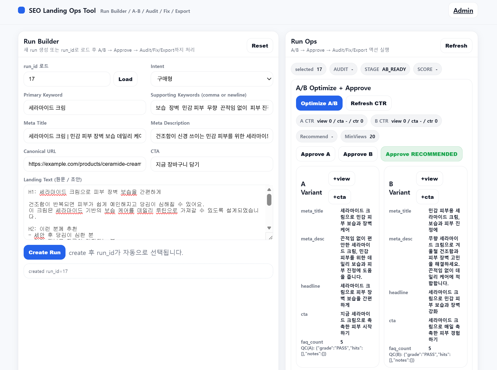
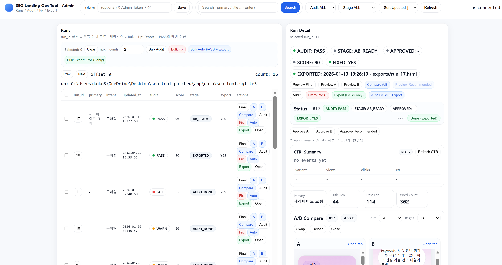
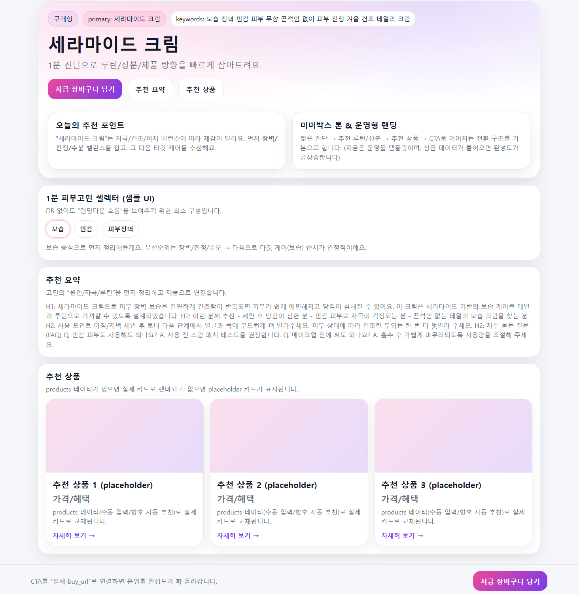

# SEO Landing Ops Tool (Google)
**A/B 카피 생성 → 이벤트 기반 CTR 비교/추천 → 승인 → SEO Audit → AI Auto-Fix(PASS) → Export HTML**  
FastAPI + SQLite 기반의 SEO 랜딩 운영 자동화(Ops) 내부 도구 프로토타입입니다.

> 포인트: “카피 생성기”가 아니라, **측정/승인/품질게이트/배포 산출물**까지 연결한 운영 시스템.

---

## Preview (Screenshots)





---

## Why this exists (Problem)
SEO 랜딩 운영은 “문장 생성”이 아니라 “운영 시스템” 문제입니다.
- 카피 생산 병목: 메타/히어로/FAQ를 여러 버전으로 만들어야 함
- 검수 리스크: 과장/오인/민감 표현이 섞이면 브랜드 리스크
- 측정-의사결정 단절: A/B 결과가 흩어져 승인까지 이어지지 않음
- SEO 체크리스트 누락: title/desc 길이, H 구조, FAQ schema 등 실무 누락 빈번
- 배포 산출물 단절: 최종 PASS를 반영한 HTML Export까지 이어져야 “운영 완료”

---

## Target users (Personas)
- **Growth Marketer(SEO)**: CTR/전환 개선, 실험 속도
- **Content Ops/검수자**: 금칙 표현 리스크 최소화, 가이드 준수
- **Dev/Publisher**: 배포 가능한 최종 HTML 산출물 확보

---

## Key features
### 1) Run 기반 운영 추적
- 입력(키워드/의도/메타/본문/CTA)을 `run_id` 단위로 저장하고 전 단계의 결과/로그를 추적

### 2) A/B 카피 생성 + QC(1차 컴플라이언스 가드)
- LLM이 Variant A/B 생성
- 금칙/리스크 표현 룰 기반 점검(QC)

### 3) 이벤트 수집 → CTR 요약 → 통계 기반 추천
- 프리뷰 랜딩에서 `view`, `cta_click` 기록
- CTR uplift 및 두 비율 z-test 기반 추천
- 추천 불가/표본 부족 상황 fallback 포함

### 4) SEO Audit 엔진
- Meta 길이/구조(H1 1개 등), 키워드 커버리지, FAQ/JSON-LD 등 점검
- overall PASS/WARN/FAIL

### 5) AI Auto-Fix to PASS (Hybrid)
- 룰 기반 1차 자동 보정 + 필요 시 LLM 리라이트 + 룰 세이프가드
- **최종 audit가 PASS가 아니면 Export 차단**

### 6) Export HTML (품질 게이트)
- **PASS일 때만** HTML Export 허용(서버 레벨 강제)
- Export 파일 저장/오픈/다운로드 제공

---

## User flow
1. Create Run → `run_id`
2. Optimize A/B → Variant A/B 생성 + QC
3. Preview A/B → 이벤트(view/cta_click) 기록
4. CTR Summary → Recommend 도출 → Approve
5. SEO Audit → PASS/WARN/FAIL
6. Fix to PASS / Auto PASS+Export
7. Export HTML (PASS only)

---

## Tech stack
- Backend: **FastAPI**
- Front: **Jinja2 Templates + Vanilla JS**
- DB: **SQLite** (runs/events/job_logs)
- LLM: **OpenAI**
- Output: **HTML Export**

---

## Quickstart
### 1) Install
```bash
pip install -r requirements.txt
